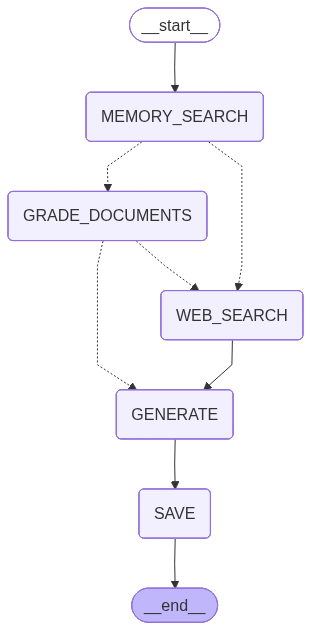

# Personalize Agent 🤖



A smart AI assistant with memory and web search capabilities, built with LangGraph and Streamlit.

## Features ✨

- **Conversational AI**: Natural language interactions
- **Web Search**: Retrieve up-to-date information
- **Memory**: Persistent conversation history
- **Modular Architecture**: Easy to extend and customize

## Tech Stack 🛠️

- **Framework**: [LangGraph](https://langchain-ai.github.io/langgraph/)
- **UI**: [Streamlit](https://streamlit.io/)
- **LLM**: OpenAI GPT-4
- **Vector Store**: [SuperMemory](https://github.com/yourusername/supermemory) (custom implementation)
- **Web Search**: Custom Tavily client

## Installation 🚀

1. Clone the repository:
   ```bash
   git clone https://github.com/yourusername/Personalise_agent.git
   cd Personalise_agent
   ```

2. Create and activate a virtual environment:
   ```bash
   python -m venv .venv
   .venv\Scripts\activate  # Windows
   source .venv/bin/activate  # Linux/Mac
   ```

3. Install dependencies:
   ```bash
   pip install -r app/requirements.txt
   ```

4. Set up environment variables:
   ```bash
   cp .env.example .env
   # Edit .env with your API keys
   ```

## Usage 💻

### Web Interface
```bash
cd app
streamlit run app.py
```

### API Server
```bash
cd app
uvicorn main:api --reload
```

## Project Structure 📁

```
app/
├── graph/               # LangGraph workflow definitions
│   ├── nodes/           # Individual node implementations
│   ├── chains/          # LangChain chains
│   └── main_graph.py    # Main workflow definition
├── utils/              # Utility functions
└── app.py              # Streamlit web interface
```

## Workflow

1. User submits a query
2. System checks memory for relevant context
3. Performs web search if needed
4. Generates response using LLM
5. Updates conversation history

## Contributing 🤝

Contributions are welcome! Please open an issue or submit a pull request.

## License 📄

This project is licensed under the MIT License - see the [LICENSE](LICENSE) file for details.

---

Made with ❤️ by [Your Name]
